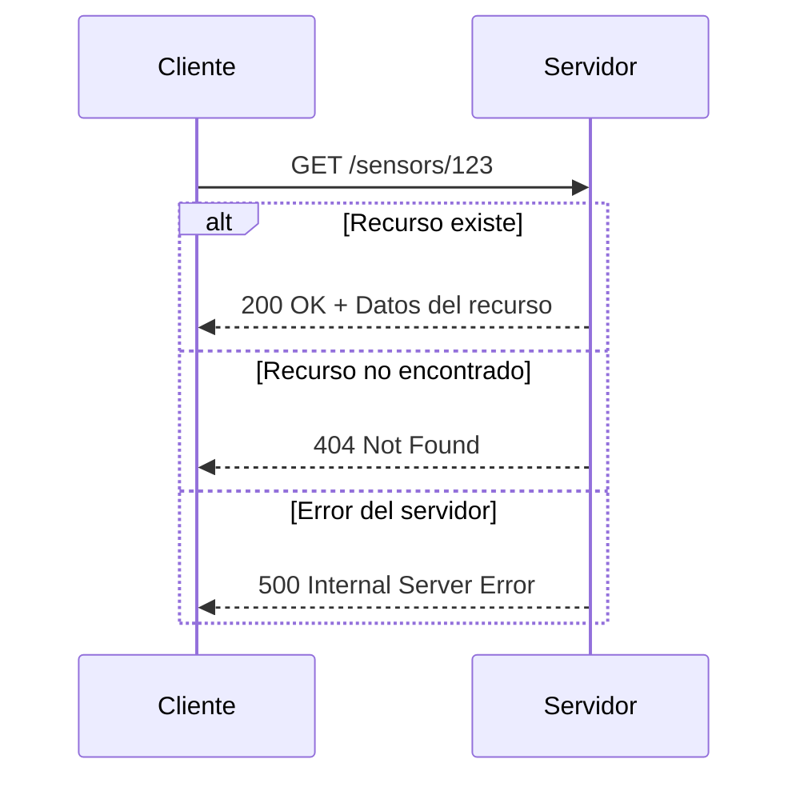
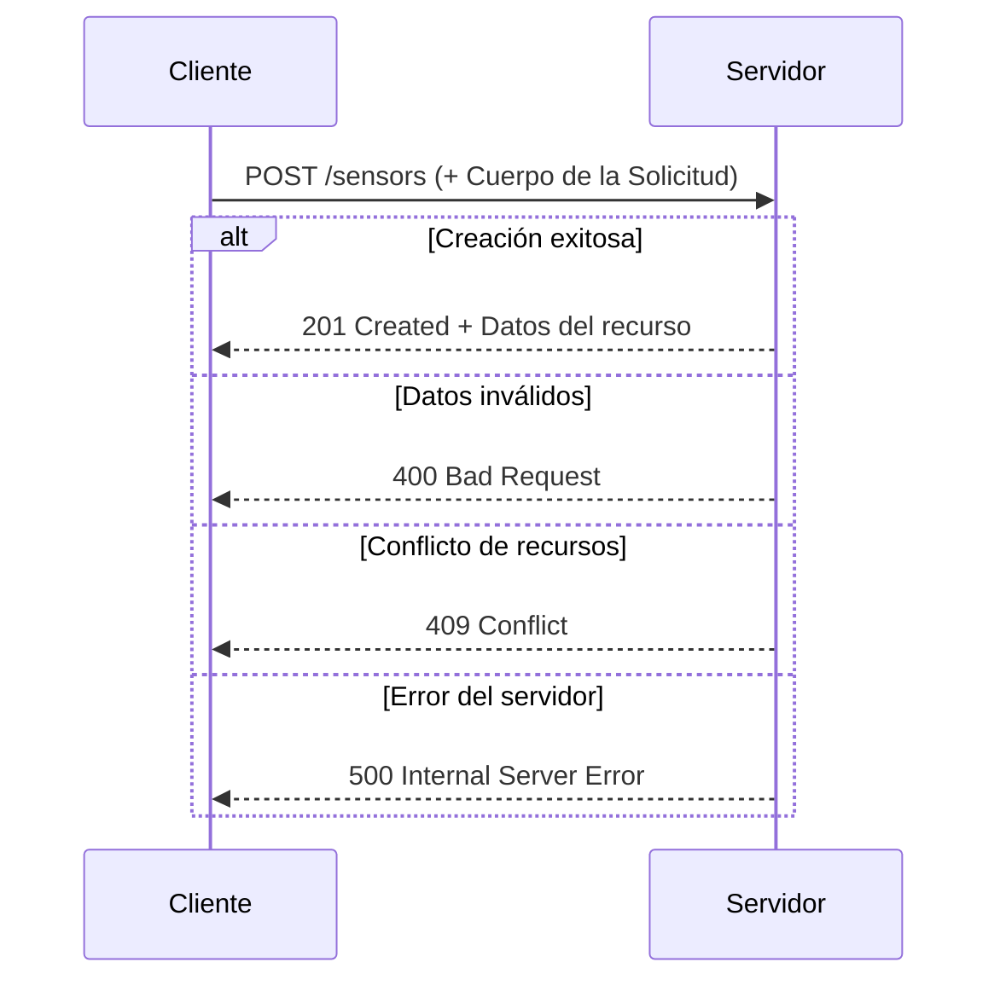
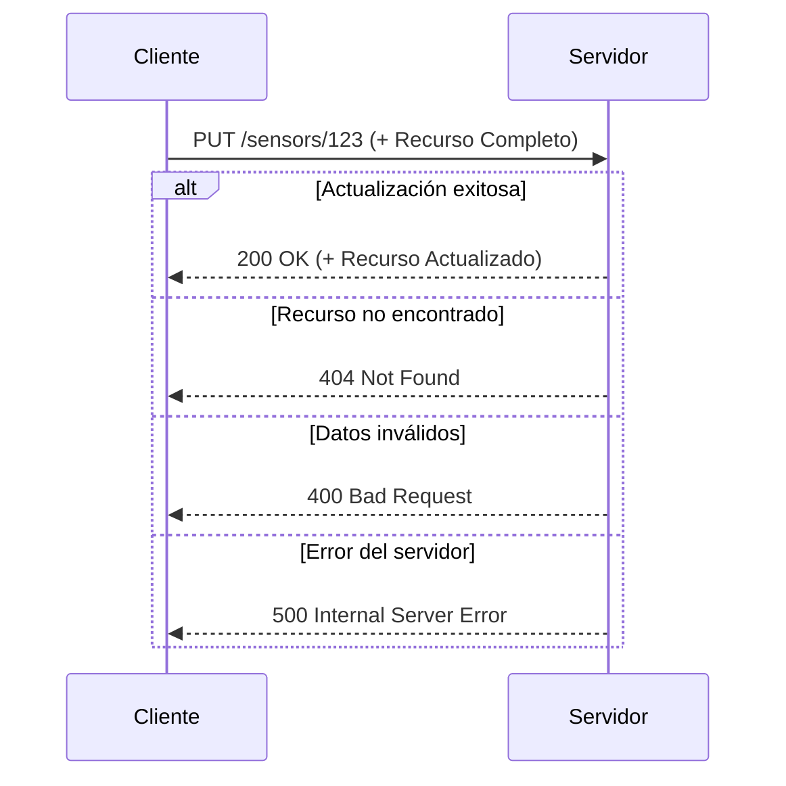
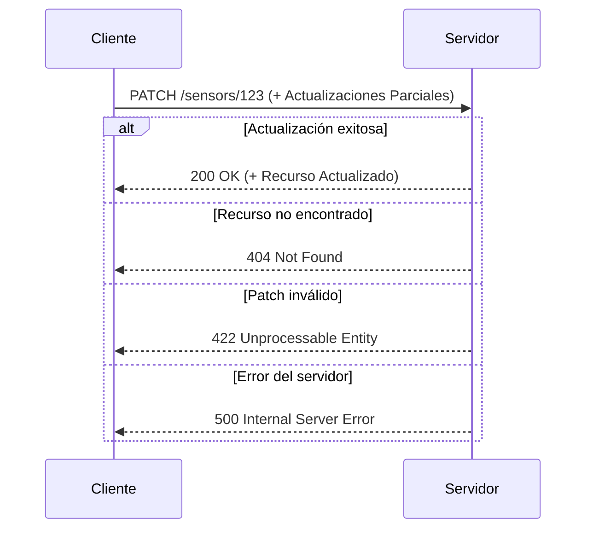
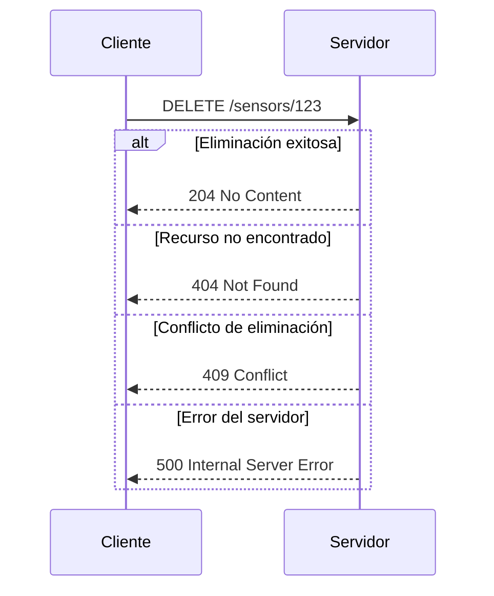
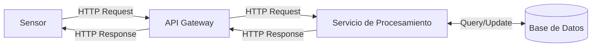
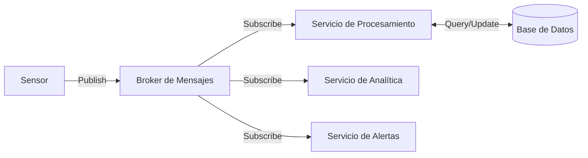
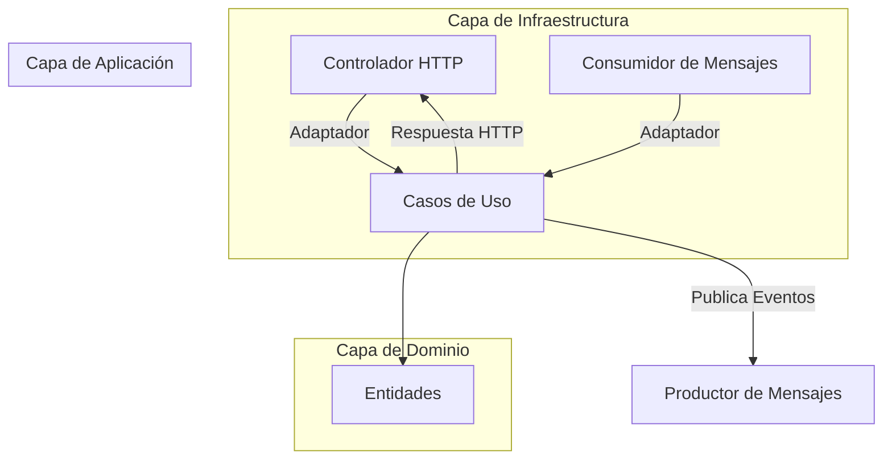
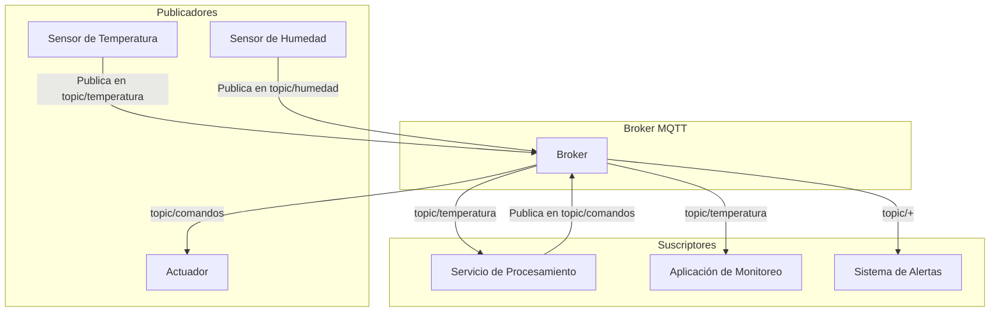
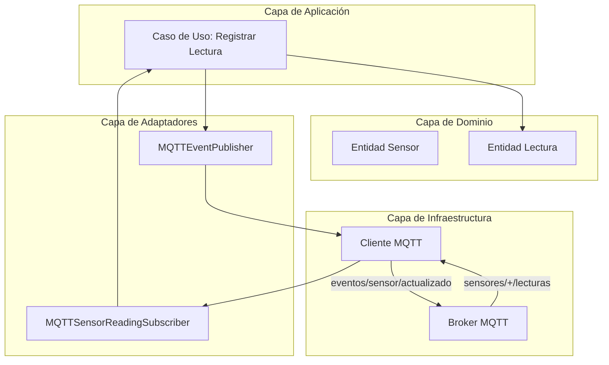

# Clean Architecture para Sistemas de Procesamiento de Sensores

## Índice

## 1. Introducción a Clean Architecture

### Conceptos fundamentales

La Clean Architecture, propuesta por Robert C. Martin (Uncle Bob), es un paradigma de diseño de software que se enfoca en separar las preocupaciones del sistema mediante capas bien definidas. Esta arquitectura promueve la creación de sistemas con características específicas que maximizan la mantenibilidad y adaptabilidad del código a largo plazo.

#### Principios clave

- **Independientes de frameworks**: El sistema no depende de la existencia de bibliotecas de software externas. Esto permite utilizar los frameworks como herramientas, evitando limitar el sistema a sus restricciones.
  
  *Ejemplo*: En nuestro sistema de sensores, podemos usar FastAPI para exponer una API REST, pero nuestras reglas de negocio no deben conocer la existencia de este framework. Si mañana necesitamos cambiar a Flask o Django, solo modificaríamos la capa externa sin tocar el núcleo del sistema.

- **Testeables**: Las reglas de negocio pueden probarse sin necesidad de interfaces de usuario, bases de datos, servidores web u otros elementos externos.
  
  *Ejemplo*: Podemos probar la lógica de validación de datos de un sensor sin necesidad de una conexión real a Redis o hacer peticiones HTTP. Las pruebas unitarias se ejecutarían rápidamente y sin dependencias externas, validando comportamientos como "el sensor rechaza temperaturas inferiores al cero absoluto" o "la humedad siempre debe estar entre 0% y 100%".

- **Independientes de la interfaz de usuario**: La UI puede cambiar fácilmente sin afectar al resto del sistema. Una interfaz web podría ser reemplazada por una consola o una API REST sin modificar las reglas de negocio.
  
  *Ejemplo*: Nuestro sistema podría comenzar con una interfaz web basada en FastAPI, pero más adelante podríamos añadir una interfaz de línea de comandos para automatizaciones o una UI gráfica para monitorización sin cambiar la lógica de procesamiento de datos. La lógica que determina si un valor de sensor es válido funcionaría igual independientemente de cómo llegue esa información.

- **Independientes de la base de datos**: Se puede intercambiar Redis, MongoDB, SQL Server o cualquier otro mecanismo de persistencia sin afectar a las reglas de negocio.
  
  *Ejemplo*: Podríamos comenzar almacenando las mediciones de sensores en Redis por su velocidad, pero si eventualmente necesitamos análisis más complejos, podríamos migrar a InfluxDB para series temporales sin modificar las reglas centrales del sistema. Para la lógica de negocio, solo importa que los datos se puedan guardar y recuperar, no dónde ni cómo se almacenan.

- **Independientes de cualquier agente externo**: Las reglas de negocio no conocen nada del mundo exterior.
  
  *Ejemplo*: Si nuestro sistema necesita obtener datos de calibración de un servicio externo, no haríamos llamadas HTTP directamente desde nuestros casos de uso, sino que definiríamos un concepto abstracto como "Servicio de Calibración" y dejaríamos que la capa externa se encargue de implementarlo mediante peticiones HTTP, archivos de configuración local, o cualquier otro método.

#### La Regla de Dependencia

El principio fundamental de Clean Architecture se resume en la **Regla de Dependencia**: 

> Las dependencias del código fuente sólo pueden apuntar hacia adentro, hacia capas de mayor nivel de abstracción (reglas de negocio).

Esta regla es crucial para mantener la integridad arquitectónica. Significa que:

1. Una capa externa puede depender de una capa interna
2. Una capa interna NUNCA debe depender de una capa externa
3. Una capa interna no debe conocer nada sobre las capas que la contienen

*Ejemplo conceptual*: Consideremos un sensor de temperatura que envía datos a través de HTTP:

- La definición de qué es una "Temperatura" y sus reglas (por ejemplo, no puede ser inferior al cero absoluto) está en el centro del sistema y no sabe nada sobre HTTP, Redis o FastAPI.
- El proceso que valida y registra una lectura de temperatura conoce el concepto de temperatura pero no sabe cómo llegan los datos ni dónde se almacenan.
- El componente que recibe peticiones HTTP conoce cómo convertir una petición en un comando para procesar la temperatura.
- El componente que guarda datos en Redis sabe cómo persistir la información, pero la lógica central solo conoce un concepto abstracto de "almacenamiento".

Para mantener esta independencia, utilizamos el **Principio de Inversión de Dependencias** (la 'D' en SOLID). Las capas internas definen interfaces que las capas externas deben implementar, invirtiendo la dirección natural de la dependencia.

#### Capas de la Clean Architecture

La Clean Architecture se organiza típicamente en cuatro capas concéntricas, donde cada capa tiene una responsabilidad específica y un nivel de abstracción diferente. Vamos a analizarlas conceptualmente para nuestro sistema de sensores:

1. **Entidades (Entities)**: 

   Representan los objetos de negocio fundamentales de la aplicación y encapsulan las reglas de negocio más críticas y generales.

   *Ejemplo conceptual*: En nuestro sistema, tendremos entidades como:
   
   - **Sensor**: Representa un dispositivo físico que captura datos del entorno. Define atributos como identificador, tipo, ubicación y factor de calibración. Contiene reglas de negocio inherentes a todos los sensores, como la capacidad de calibrar valores brutos o determinar si una lectura está dentro de rangos físicamente posibles.
   
   - **Lectura**: Representa una medición capturada por un sensor en un momento específico. Contiene el valor bruto, el valor calibrado, marca de tiempo, y estado de validez.
   
   - **Digital Twin**: Representación virtual completa de un sensor físico, que incluye tanto sus atributos estáticos como su estado dinámico, historial de lecturas y comportamiento predicho.

   Lo importante es que estas entidades no tienen dependencias externas y contienen las reglas invariables del dominio.

2. **Casos de Uso (Use Cases)**: 

   Contienen reglas de negocio específicas de la aplicación. Orquestan el flujo de datos y dirigen las entidades para lograr objetivos específicos de la aplicación.

   *Ejemplo conceptual*: Para nuestro sistema, podríamos tener casos de uso como:
   
   - **Procesar Lectura de Sensor**: Recibe datos crudos de un sensor, recupera la información del sensor correspondiente, aplica calibración, valida los datos según las reglas del tipo de sensor, y almacena la lectura. Si detecta anomalías, genera notificaciones.
   
   - **Actualizar Digital Twin**: Actualiza la representación virtual (digital twin) de un sensor con la última información disponible, incluyendo lecturas recientes y cambios de estado.
   
   - **Generar Alertas**: Analiza patrones en las lecturas para detectar comportamientos anómalos o peligrosos y envía notificaciones correspondientes.
   
   Estos casos de uso conocen las entidades, pero no saben sobre bases de datos específicas, protocolos de comunicación o interfaces de usuario. Trabajan con interfaces abstractas como "Repositorio de Sensores" o "Servicio de Notificaciones".

3. **Adaptadores de Interfaz (Interface Adapters)**: 

   Convierten los datos entre los formatos convenientes para casos de uso/entidades y los formatos para sistemas externos. Hacen de puente entre el núcleo de la aplicación y el mundo exterior.

   *Ejemplo conceptual*: En nuestro sistema, tendríamos adaptadores como:
   
   - **Controladores de API**: Reciben peticiones HTTP con datos de sensores, las validan según el formato esperado, las convierten al formato que entienden los casos de uso, invocan el caso de uso correspondiente, y finalmente transforman el resultado en una respuesta HTTP.
   
   - **Repositorios de Persistencia**: Implementan las interfaces definidas por los casos de uso para almacenar y recuperar datos. Por ejemplo, un "Repositorio de Lecturas en Redis" conocería los detalles específicos de cómo estructurar las claves en Redis, qué estructuras de datos usar (hashes, listas, etc.), y cómo convertir entre objetos de dominio y el formato de Redis.
   
   - **Servicios de Notificación**: Adaptan conceptos abstractos como "Enviar Alerta" a implementaciones concretas como enviar un email, publicar en un topic MQTT, o enviar un mensaje a un webhook.

4. **Frameworks y Drivers**: 

   Es la capa más externa, compuesta por frameworks y herramientas como bases de datos, frameworks web o cualquier otro dispositivo o sistema externo.

   *Ejemplo conceptual*: En nuestro sistema, esta capa incluiría:
   
   - **FastAPI**: El framework web que maneja las peticiones HTTP, define rutas, gestiona middleware, etc.
   
   - **Redis**: La base de datos que almacena físicamente los datos, con sus particularidades de conexión, comandos específicos, y estructuras de datos.
   
   - **Clientes HTTP**: Bibliotecas que permiten hacer peticiones a servicios externos, como servicios de calibración o APIs de terceros.
   
   - **Bibliotecas de Email/MQTT/etc.**: Para implementar diferentes canales de notificación.

   Esta capa contiene todos los detalles de implementación y normalmente es donde ocurre la configuración de la aplicación, inyección de dependencias, y el "cableado" de los diferentes componentes.

### Beneficios en sistemas de sensores

La implementación de Clean Architecture en un sistema de procesamiento de sensores ofrece ventajas significativas:

1. **Adaptabilidad a diferentes tipos de sensores**: Al abstraer las operaciones básicas de los sensores en entidades e interfaces, el sistema puede adaptarse fácilmente para trabajar con nuevos tipos de sensores sin modificar la lógica central.

2. **Independencia del método de adquisición de datos**: Ya sea que los datos provengan de HTTP, MQTT, archivos CSV o cualquier otro formato, la lógica de negocio permanece inalterada.

3. **Flexibilidad en el almacenamiento**: Podemos comenzar con Redis como solución de almacenamiento, pero migrar a una base de datos de series temporales u otra solución sin afectar la lógica central.

4. **Facilidad para implementar Digital Twins**: La separación clara entre el modelo del mundo real (entidades) y su representación digital facilita la implementación del concepto de Digital Twin.

5. **Escalabilidad**: La arquitectura permite escalar diferentes componentes de forma independiente según las necesidades (procesamiento, almacenamiento, interfaces).

6. **Testabilidad mejorada**: Cada componente puede probarse de manera aislada, lo que es crucial en sistemas donde la precisión de las mediciones y el procesamiento son críticos.

### Comparación con otras arquitecturas

| Arquitectura | Fortalezas | Debilidades | Cuándo usar en sistemas de sensores |
|--------------|------------|-------------|-------------------------------------|
| **Arquitectura en Capas Tradicional** | Simple de entender. Fácil de implementar inicialmente. | Las capas inferiores no conocen las superiores, pero las superiores dependen de las inferiores, creando acoplamiento. | Para proyectos pequeños con pocos tipos de sensores y procesamiento simple. |
| **Arquitectura de Microservicios** | Alta escalabilidad. Despliegue independiente. | Complejidad operativa. Latencia en comunicación entre servicios. | Sistemas muy grandes con diferentes tipos de sensores y procesamiento distribuido. |
| **Arquitectura Hexagonal** | Aísla la lógica de negocio del mundo exterior mediante puertos y adaptadores. | Puede resultar en muchas interfaces y adaptadores. | Similar a Clean Architecture, buena alternativa con enfoque ligeramente diferente. |
| **Arquitectura Basada en Eventos** | Excelente para procesamiento en tiempo real. Bajo acoplamiento. | Puede ser difícil de razonar sobre el flujo de control. | Ideal para sistemas con muchos sensores que publican datos de forma asíncrona. |
| **Clean Architecture** | Independencia de frameworks. Alta testabilidad. Separación clara de responsabilidades. | Curva de aprendizaje inicial. Puede parecer excesiva para proyectos pequeños. | Ideal para sistemas que evolucionarán con el tiempo, con múltiples fuentes de datos y requisitos cambiantes. |

Para nuestro sistema de procesamiento de sensores, la Clean Architecture ofrece el equilibrio perfecto entre flexibilidad y estructura. Nos permitirá construir un sistema modular que podrá evolucionar con el tiempo, incorporar diferentes tipos de sensores, métodos de procesamiento y tecnologías de almacenamiento, manteniendo siempre la lógica de negocio central aislada y protegida de cambios externos.

## 2. Estructura del Proyecto

### Organización de carpetas

En una aplicación que sigue Clean Architecture, la estructura de carpetas refleja la separación de responsabilidades y las capas arquitectónicas. Para nuestro sistema de procesamiento de sensores, una estructura recomendada sería:

```
src/
│
├── domain/                   # Capa de entidades y reglas de negocio centrales
│   ├── entities/             # Definiciones de entidades (Sensor, Reading, etc.)
│   ├── exceptions/           # Excepciones específicas del dominio
│   └── value_objects/        # Objetos de valor inmutables
│
├── application/              # Capa de casos de uso
│   ├── interfaces/           # Interfaces (puertos) que definen repositorios y servicios
│   ├── services/             # Servicios de aplicación
│   └── use_cases/            # Implementación de casos de uso específicos
│
├── infrastructure/           # Capa de frameworks y drivers
│   ├── database/             # Implementaciones específicas de persistencia (Redis)
│   │   └── repositories/     # Implementaciones concretas de repositorios
│   ├── api/                  # Configuración de FastAPI
│   │   └── routes/           # Definición de rutas y endpoints
│   ├── messaging/            # Implementaciones de comunicación (si aplicable)
│   └── services/             # Implementaciones concretas de servicios externos
│
└── interfaces/               # Capa de adaptadores de interfaz
    ├── controllers/          # Controladores que adaptan entrada de la API a casos de uso
    ├── presenters/           # Adaptadores que formatean resultados para presentación
    └── serializers/          # Conversores entre formatos de datos
```

Esta estructura organiza el código siguiendo los principios de Clean Architecture, facilitando la navegación y comprensión del sistema. La organización es flexible y puede adaptarse según las necesidades específicas del proyecto.

### Separación por capas

La estructura anterior refleja las cuatro capas principales de Clean Architecture, cada una con responsabilidades bien definidas:

1. **Capa de dominio (`domain/`)**: Contiene las entidades de negocio y las reglas fundamentales que son el corazón del sistema. Esta capa debe ser completamente independiente de cualquier framework o tecnología específica.

   - **Entidades**: Sensores, lecturas, parámetros de configuración
   - **Objetos de valor**: Representaciones inmutables como coordenadas, unidades de medida, rangos válidos
   - **Excepciones de dominio**: Errores específicos del negocio como "LecturaInválida" o "SensorNoCalibrado"

2. **Capa de aplicación (`application/`)**: Contiene los casos de uso que orquestan el flujo de datos hacia y desde las entidades, y dirigen la lógica de negocio específica de la aplicación.

   - **Casos de uso**: "ProcesarLecturaSensor", "ActualizarDigitalTwin", "GenerarAlerta"
   - **Interfaces de repositorio**: Definiciones abstractas de cómo interactuar con el almacenamiento
   - **Interfaces de servicio**: Definiciones abstractas de servicios externos (notificaciones, etc.)

3. **Capa de interfaces (`interfaces/`)**: Adapta la información entre los formatos más convenientes para los casos de uso y los formatos más convenientes para los agentes externos.

   - **Controladores**: Reciben peticiones HTTP y las traducen a llamadas a casos de uso
   - **Presentadores**: Traducen los resultados de los casos de uso en formatos adecuados para la presentación
   - **Serializadores**: Convierten entre diferentes formatos de datos (JSON, objetos de dominio, etc.)

4. **Capa de infraestructura (`infrastructure/`)**: Contiene la implementación concreta de interfaces definidas en las capas interiores, utilizando frameworks y herramientas específicas.

   - **Repositorios Redis**: Implementan las interfaces de repositorio usando Redis
   - **Configuración FastAPI**: Configura y conecta el framework web
   - **Servicios externos**: Implementan las interfaces de servicio usando tecnologías concretas

### Flujo de dependencias

El flujo de dependencias en Clean Architecture siempre debe dirigirse hacia el interior, es decir, hacia el dominio. Esto se refleja en nuestra estructura de proyecto de la siguiente manera:

1. **La capa de dominio** no depende de ninguna otra capa. Es completamente autónoma y contiene solo las reglas de negocio más puras.

2. **La capa de aplicación** depende únicamente de la capa de dominio. Sus casos de uso operan sobre entidades del dominio, pero utilizan interfaces abstractas (puertos) para comunicarse con el mundo exterior.

3. **La capa de interfaces** depende de la capa de aplicación y de dominio. Conoce los casos de uso y las entidades, pero no conoce detalles de implementación de la infraestructura.

4. **La capa de infraestructura** depende de todas las demás capas. Implementa las interfaces definidas en la capa de aplicación y utiliza los controladores de la capa de interfaces.

Este flujo de dependencias se mantiene mediante el uso del Principio de Inversión de Dependencias:

- Las capas interiores definen interfaces (puertos)
- Las capas exteriores implementan estas interfaces (adaptadores)
- La inyección de dependencias conecta todo en tiempo de ejecución

**Diagrama conceptual del flujo de dependencias:**

```
                  ┌───────────────────┐
                  │                   │
                  │     Domain        │◄─────────────┐
                  │                   │              │
                  └───────────────────┘              │
                          ▲                          │
                          │                          │
                  ┌───────────────────┐              │
                  │                   │              │
                  │   Application     │◄─────┐       │
                  │                   │      │       │
                  └───────────────────┘      │       │
                          ▲                  │       │
                          │                  │       │
                  ┌───────────────────┐      │       │
                  │                   │      │       │
                  │    Interfaces     │◄─────┘       │
                  │                   │              │
                  └───────────────────┘              │
                          ▲                          │
                          │                          │
                  ┌───────────────────┐              │
                  │                   │              │
                  │  Infrastructure   │◄─────────────┘
                  │                   │
                  └───────────────────┘
```

En este diagrama, las flechas representan dependencias. Observa cómo todas las flechas apuntan hacia arriba, hacia las capas más internas, nunca hacia abajo. Esto garantiza que las capas internas permanezcan independientes de las externas, siguiendo la Regla de Dependencia.

Para nuestro sistema de sensores, este flujo tiene beneficios concretos:
- Podemos probar la lógica de validación de lecturas de sensores sin necesidad de una base de datos real
- Podemos cambiar de Redis a otra base de datos modificando solo la capa de infraestructura
- Podemos implementar nuevas interfaces (como una API GraphQL o una interfaz de línea de comandos) sin modificar la lógica de negocio
- El Digital Twin puede evolucionar independientemente de cómo se almacenan o visualizan sus datos


## 3. Entidades y Casos de Uso

### Modelado del Digital Twin

El concepto de Digital Twin (Gemelo Digital) es fundamental en sistemas modernos de IoT y procesamiento de sensores. Un Digital Twin es una representación virtual de un objeto o sistema del mundo real que sirve como puente digital entre el mundo físico y el digital. En nuestro sistema, implementaremos este concepto siguiendo los principios de Clean Architecture.

#### Concepto y propósito

Un Digital Twin en nuestro sistema debe:

1. **Representar fielmente el estado actual del sensor físico**: Incluyendo su configuración, estado operativo, y últimas lecturas.

2. **Mantener un historial relevante**: Almacenar un conjunto representativo de lecturas históricas para análisis de tendencias y patrones.

3. **Permitir simulación y predicción**: Facilitar la predicción de comportamientos futuros basados en datos históricos y modelos.

4. **Servir como punto único de verdad**: Centralizar toda la información relacionada con un sensor específico.

#### Estructura conceptual del Digital Twin

En términos de Clean Architecture, el Digital Twin es una entidad compleja compuesta por:

- **Información estática**: Identificadores, tipo de sensor, ubicación, fecha de instalación, especificaciones técnicas, etc.
- **Estado operativo**: Activo/inactivo, modo de operación, estado de la batería, última comunicación, etc.
- **Historial de lecturas**: Conjunto de mediciones históricas con sus metadatos.
- **Configuración**: Parámetros de calibración, intervalos de muestreo, umbrales de alerta, etc.
- **Metadatos de mantenimiento**: Fechas de mantenimiento, calibración, incidencias, etc.

#### Modelado en el sistema

Desde la perspectiva de Clean Architecture, el Digital Twin se modelará como:

- **Entidad principal**: La entidad `DigitalTwin` será una entidad agregada que contiene o referencia otras entidades y objetos de valor.
- **Entidades relacionadas**: `Sensor`, `SensorReading`, `Calibration`, etc.
- **Objetos de valor**: `Location`, `MeasurementUnit`, `ThresholdSettings`, etc.
- **Servicios de dominio**: Funcionalidades como `DetectAnomaly`, `PredictTrend`, etc.

Este modelado nos permitirá mantener la lógica de dominio encapsulada y separada de preocupaciones de infraestructura como la persistencia o la comunicación.

### Definición de entidades de sensores

Las entidades representan los objetos centrales de nuestro dominio y encapsulan las reglas de negocio críticas. Para nuestro sistema de procesamiento de sensores, definiremos las siguientes entidades clave:

#### Sensor

La entidad `Sensor` representa el dispositivo físico que captura datos. Sus atributos y comportamientos incluyen:

- **Atributos**:
  - Identificador único
  - Tipo de sensor (temperatura, humedad, presión, etc.)
  - Ubicación (posiblemente un objeto de valor)
  - Especificaciones técnicas (rango de medición, precisión, etc.)
  - Factor de calibración
  - Estado (activo, inactivo, mantenimiento)

- **Comportamientos**:
  - Aplicar calibración a una lectura bruta
  - Validar si una lectura está dentro de rangos físicamente posibles
  - Activar/desactivar el sensor
  - Actualizar factores de calibración

- **Reglas de negocio**:
  - Un sensor debe tener un tipo válido
  - Los factores de calibración deben estar dentro de rangos razonables
  - Ciertas operaciones solo se permiten si el sensor está activo

#### SensorReading (Lectura)

La entidad `SensorReading` representa una medición individual capturada por un sensor:

- **Atributos**:
  - Identificador único
  - Referencia al sensor que la generó
  - Valor bruto (como fue recibido)
  - Valor calibrado (después de aplicar calibraciones)
  - Marca de tiempo
  - Estado de validez (válida, inválida, sospechosa)
  - Metadatos adicionales (condiciones ambientales, etc.)

- **Comportamientos**:
  - Validar si la lectura es física y lógicamente posible
  - Calcular valores derivados o normalizados

- **Reglas de negocio**:
  - Una lectura debe estar asociada a un sensor existente
  - El valor bruto debe estar dentro del rango físico posible para el tipo de sensor
  - La marca de tiempo no puede ser futura

#### Otras entidades relevantes

- **Calibration**: Registra eventos de calibración con sus parámetros y resultados
- **MaintenanceRecord**: Registra actividades de mantenimiento en sensores
- **Alert**: Representa una alerta generada por condiciones anómalas
- **SensorGroup**: Agrupación lógica de sensores relacionados

#### Objetos de valor

Los objetos de valor son inmutables y describen características del dominio:

- **Location**: Coordenadas geográficas o ubicación estructurada
- **MeasurementRange**: Rango válido de medición para un tipo de sensor
- **MeasurementUnit**: Unidad de medida con conversiones
- **TimeInterval**: Intervalo de tiempo para agregaciones o muestreo

### Casos de uso principales

Los casos de uso representan las operaciones principales que nuestro sistema puede realizar. Encapsulan la lógica de aplicación específica y orquestan las entidades para lograr objetivos concretos. A continuación, definimos los casos de uso más relevantes para nuestro sistema:

#### 1. Registrar Lectura de Sensor

**Propósito**: Procesar una nueva lectura recibida de un sensor, aplicando validaciones, calibraciones y persistencia.

**Actores**: Sensor físico, Sistema de ingesta de datos

**Flujo principal**:
1. Recibir datos brutos del sensor
2. Validar formato y completitud de los datos
3. Recuperar información del sensor correspondiente
4. Aplicar factor de calibración a la lectura
5. Validar si la lectura está dentro de rangos aceptables
6. Crear entidad SensorReading
7. Almacenar la lectura en el repositorio
8. Actualizar el estado del Digital Twin
9. Verificar si la lectura genera alertas

**Interfaces requeridas**:
- SensorRepository: Para recuperar información del sensor
- ReadingRepository: Para almacenar la nueva lectura
- NotificationService: Para enviar alertas si es necesario

#### 2. Actualizar Digital Twin

**Propósito**: Mantener actualizada la representación virtual completa de un sensor físico.

**Actores**: Sistema (programado o bajo demanda)

**Flujo principal**:
1. Recuperar información actual del sensor
2. Obtener las lecturas más recientes
3. Calcular estadísticas agregadas (promedios, tendencias, etc.)
4. Actualizar el estado operativo del Digital Twin
5. Aplicar modelos predictivos si es aplicable
6. Persistir el estado actualizado

**Interfaces requeridas**:
- DigitalTwinRepository: Para recuperar y actualizar el estado
- SensorRepository: Para información actual del sensor
- ReadingRepository: Para acceder al historial de lecturas
- AnalyticsService: Para aplicar modelos predictivos

#### 3. Configurar Sensor

**Propósito**: Modificar la configuración de un sensor existente en el sistema.

**Actores**: Administrador, Sistema automatizado

**Flujo principal**:
1. Validar los parámetros de configuración
2. Recuperar el sensor existente
3. Aplicar los cambios de configuración
4. Validar que el sensor sigue en estado coherente
5. Persistir los cambios
6. Actualizar el Digital Twin correspondiente
7. Registrar la actividad de configuración

**Interfaces requeridas**:
- SensorRepository: Para recuperar y actualizar el sensor
- DigitalTwinRepository: Para actualizar la representación virtual
- ActivityLogService: Para registrar la actividad

#### 4. Generar Alerta por Anomalía

**Propósito**: Detectar condiciones anómalas en las lecturas de sensores y generar las alertas correspondientes.

**Actores**: Sistema (automático)

**Flujo principal**:
1. Analizar una lectura nueva o un conjunto de lecturas
2. Aplicar reglas de detección de anomalías
3. Si se detecta anomalía, crear entidad Alert
4. Determinar nivel de severidad y destinatarios
5. Persistir la alerta
6. Notificar a los canales correspondientes

**Interfaces requeridas**:
- ReadingRepository: Para acceder a las lecturas
- AlertRepository: Para persistir la alerta
- NotificationService: Para enviar notificaciones
- AnomalyDetectionService: Para aplicar algoritmos de detección

#### 5. Procesar Datos Históricos

**Propósito**: Realizar análisis sobre datos históricos de sensores para extraer información valiosa.

**Actores**: Analista, Sistema programado

**Flujo principal**:
1. Definir parámetros de análisis (rango de tiempo, sensores, etc.)
2. Recuperar datos históricos relevantes
3. Aplicar algoritmos de procesamiento (agregación, correlación, etc.)
4. Generar resultados de análisis
5. Persistir resultados si es necesario
6. Preparar visualización o exportación

**Interfaces requeridas**:
- ReadingRepository: Para recuperar datos históricos
- AnalyticsRepository: Para persistir resultados
- DataProcessingService: Para aplicar algoritmos de análisis

#### Diagrama de interacción conceptual

El siguiente diagrama ilustra cómo interactúan los casos de uso con las entidades y las interfaces externas:

```
┌───────────────────┐         ┌───────────────────┐
│                   │         │                   │
│  Entidad Sensor   │◄────────┤  Entidad Lectura  │
│                   │         │                   │
└───────────────────┘         └───────────────────┘
       ▲                               ▲
       │                               │
       │                               │
       │                               │
┌──────┴────────────┐         ┌───────┴───────────┐
│                   │         │                   │
│ Caso de Uso:      │         │ Caso de Uso:      │
│ Configurar Sensor │         │ Registrar Lectura │
│                   │         │                   │
└───────────────────┘         └───────────────────┘
       │                               │
       │                               │
       ▼                               ▼
┌───────────────────┐         ┌───────────────────┐
│                   │         │                   │
│ SensorRepository  │         │ ReadingRepository │
│ (Interfaz)        │         │ (Interfaz)        │
│                   │         │                   │
└───────────────────┘         └───────────────────┘
```

Este modelo de entidades y casos de uso constituye el núcleo de nuestro sistema siguiendo Clean Architecture. Al definir claramente estas estructuras, establecemos una base sólida para implementar un sistema flexible, testeable y mantenible para el procesamiento de datos de sensores.

## 4. Interfaces y Adaptadores

En Clean Architecture, las interfaces y adaptadores forman la capa que conecta el núcleo de la aplicación (entidades y casos de uso) con el mundo exterior. Esta capa traduce los datos entre los formatos más convenientes para las entidades y los formatos requeridos por elementos externos como frameworks web, bases de datos o servicios.

### API con FastAPI

FastAPI es un framework moderno para la creación de APIs con Python que ofrece alto rendimiento, tipado estático opcional y generación automática de documentación. En nuestra arquitectura, FastAPI pertenece a la capa más externa (frameworks y drivers), pero necesita adaptadores que lo conecten con nuestros casos de uso.

#### Integración con Clean Architecture

Para mantener la separación de responsabilidades, integraremos FastAPI de la siguiente manera:

1. **Controladores**: Crearemos controladores que recibirán las peticiones HTTP y las transformarán en llamadas a casos de uso.

2. **Presentadores**: Convertirán los resultados de los casos de uso en respuestas HTTP adecuadas.

3. **Esquemas**: Definiremos modelos de datos específicos para la API (usando Pydantic) que serán distintos de nuestras entidades de dominio.

4. **Rutas**: Configuraremos las rutas de la API que dirigirán las peticiones a los controladores correspondientes.

#### Estructura conceptual

```
interfaces/
├── api/
│   ├── controllers/         # Adaptadores que traducen peticiones HTTP a comandos de aplicación
│   ├── schemas/             # Modelos Pydantic para validación y serialización
│   └── presenters/          # Formatean resultados para respuestas HTTP
│
infrastructure/
├── api/
│   ├── routes/              # Definición de endpoints API
│   ├── middleware/          # Middleware de FastAPI (autenticación, logging, etc.)
│   └── app.py               # Configuración principal de FastAPI
```

#### Endpoints principales

Para nuestro sistema de procesamiento de sensores, diseñaremos los siguientes endpoints:

1. **Gestión de sensores**:
   - `POST /sensors`: Registrar un nuevo sensor
   - `GET /sensors`: Listar sensores disponibles
   - `GET /sensors/{id}`: Obtener información de un sensor específico
   - `PUT /sensors/{id}`: Actualizar configuración de un sensor
   - `DELETE /sensors/{id}`: Eliminar un sensor

2. **Gestión de lecturas**:
   - `POST /readings`: Registrar una nueva lectura de sensor
   - `GET /sensors/{id}/readings`: Obtener historial de lecturas de un sensor
   - `GET /readings`: Consultar lecturas con filtros (tiempo, tipo, etc.)

3. **Digital Twins**:
   - `GET /digital-twins/{sensor_id}`: Obtener el Digital Twin completo de un sensor
   - `PATCH /digital-twins/{sensor_id}`: Actualizar aspectos específicos del Digital Twin

4. **Alertas y Notificaciones**:
   - `GET /alerts`: Consultar alertas activas o históricas
   - `POST /alerts/settings`: Configurar umbrales y reglas de alertas

5. **Analítica**:
   - `GET /analytics/sensors/{id}`: Obtener estadísticas de un sensor
   - `POST /analytics/report`: Generar reportes personalizados

#### Ejemplo conceptual de controlador

Un controlador en nuestra arquitectura actúa como un adaptador entre FastAPI y los casos de uso:

```
SensorController:
  - Dependencias: RegisterSensorUseCase, UpdateSensorUseCase, GetSensorUseCase
  - Métodos:
    - register_sensor(sensor_data): Valida los datos, llama a RegisterSensorUseCase y formatea la respuesta
    - get_sensor(sensor_id): Llama a GetSensorUseCase y transforma el resultado para la API
    - update_sensor(sensor_id, data): Valida los datos, llama a UpdateSensorUseCase y formatea la respuesta
```

Este enfoque garantiza que la lógica de la API esté separada de la lógica de negocio, permitiendo cambiar la interfaz sin afectar el núcleo de la aplicación.

### Persistencia con Redis

Redis es una base de datos en memoria que proporciona alta velocidad y flexibilidad con diferentes estructuras de datos. En nuestra arquitectura, utilizaremos Redis para almacenar datos de sensores, lecturas y Digital Twins, pero mantendremos esta implementación aislada de nuestro núcleo de aplicación.

#### Diseño de repositorios

Siguiendo el patrón de repositorio, crearemos interfaces en la capa de aplicación que definan operaciones de persistencia, y luego implementaremos estas interfaces con adaptadores específicos para Redis:

```
application/
├── interfaces/
│   ├── repositories/
│   │   ├── sensor_repository.py     # Interfaz abstracta para operaciones con sensores
│   │   ├── reading_repository.py    # Interfaz abstracta para operaciones con lecturas
│   │   └── digital_twin_repository.py # Interfaz abstracta para Digital Twins

infrastructure/
├── database/
│   ├── redis/
│   │   ├── repositories/
│   │   │   ├── redis_sensor_repository.py     # Implementación para Redis
│   │   │   ├── redis_reading_repository.py    # Implementación para Redis
│   │   │   └── redis_digital_twin_repository.py # Implementación para Redis
│   │   └── connection.py            # Gestión de conexiones a Redis
```

#### Estrategias de modelado en Redis

Redis no es una base de datos relacional tradicional, por lo que necesitamos diseñar cuidadosamente cómo modelaremos nuestros datos:

1. **Sensores**:
   - Clave: `sensor:{id}`
   - Valor: Hash con atributos del sensor (tipo, ubicación, etc.)
   - Índice secundario: Conjunto `sensors:by:type:{type}` para búsquedas por tipo

2. **Lecturas**:
   - Clave: `reading:{sensor_id}:{timestamp}`
   - Valor: Hash con detalles de la lectura
   - Series temporales: Lista ordenada `readings:{sensor_id}` con referencias a lecturas por timestamp
   - Para análisis: Posible uso de RedisTimeSeries module para datos de series temporales

3. **Digital Twins**:
   - Clave: `digital_twin:{sensor_id}`
   - Valor: Hash con el estado actual del Digital Twin
   - Historial: Listas o conjuntos ordenados con estados históricos

4. **Alertas**:
   - Clave: `alert:{id}`
   - Valor: Hash con detalles de la alerta
   - Índices: Conjuntos para alertas activas, por sensor, por severidad, etc.

#### Patrones de acceso a datos

Para optimizar el rendimiento y mantener la consistencia, utilizaremos patrones específicos:

1. **Transacciones Redis**: Para operaciones que deben ser atómicas
2. **Pipelines**: Para reducir la latencia de red al ejecutar múltiples comandos
3. **Caching**: Uso de estrategias de caché para datos frecuentemente accedidos
4. **Expiración de datos**: TTLs (Time-To-Live) para datos temporales o históricos

#### Ejemplo conceptual de repositorio Redis

Un repositorio Redis actúa como un adaptador entre nuestra aplicación y la base de datos:

```
RedisSensorRepository:
  - Implementa: SensorRepository (interfaz)
  - Dependencias: Conexión Redis
  - Métodos:
    - save(sensor): Convierte la entidad Sensor a formato Redis y almacena
    - find_by_id(id): Recupera datos de Redis y los convierte a entidad Sensor
    - find_by_type(type): Utiliza índices secundarios para buscar por tipo
    - update(sensor): Actualiza datos en Redis manteniendo consistencia
```

Esta implementación encapsula todos los detalles específicos de Redis, permitiendo reemplazar la tecnología de persistencia sin afectar la lógica de negocio.

### Adaptadores de entrada/salida

Los adaptadores son componentes que conectan nuestro sistema con el mundo exterior, ya sea recibiendo datos (adaptadores de entrada) o enviando datos (adaptadores de salida). Estos adaptadores traducen entre el formato interno de nuestra aplicación y los formatos externos.

#### Adaptadores de entrada

Los adaptadores de entrada transforman las solicitudes externas en llamadas a casos de uso:

1. **Controladores API**: Como se describió anteriormente, reciben peticiones HTTP y las traducen a comandos de casos de uso.

2. **Consumidores de Mensajes**: Para sistemas que reciben datos por colas de mensajes o protocolos de IoT.
   ```
   MQTTSensorReadingConsumer:
     - Escucha mensajes MQTT de sensores
     - Valida y transforma el formato de mensaje
     - Invoca el caso de uso RegisterReadingUseCase
   ```

3. **Importadores de Archivos**: Para procesar datos de archivos CSV, Excel, etc.
   ```
   CSVReadingImporter:
     - Lee archivo CSV con lecturas históricas
     - Transforma cada fila en un objeto de dominio
     - Ejecuta procesos por lotes para registrarlos
   ```

#### Adaptadores de salida

Los adaptadores de salida implementan interfaces definidas por la aplicación para comunicarse con servicios externos:

1. **Repositorios**: Implementan interfaces de persistencia para una tecnología específica (Redis en nuestro caso).

2. **Servicios de Notificación**: Envían alertas o notificaciones por diferentes canales.
   ```
   EmailNotificationService:
     - Implementa NotificationService (interfaz)
     - Envía alertas por correo electrónico
     - Formatea el contenido según plantillas
   ```

3. **Integraciones con servicios externos**: Para comunicarse con APIs o servicios de terceros.
   ```
   WeatherAPIService:
     - Implementa WeatherService (interfaz)
     - Consulta APIs externas de clima
     - Traduce respuestas al formato interno
   ```

4. **Presentadores**: Formatean los resultados de casos de uso para la presentación.
   ```
   JSONSensorPresenter:
     - Convierte entidades Sensor en representaciones JSON
     - Aplica transformaciones según el contexto de la API
     - Incluye o excluye campos según permisos o necesidades
   ```

#### Principios para el diseño de adaptadores

1. **Responsabilidad única**: Cada adaptador debe tener una única responsabilidad bien definida.

2. **Independencia del núcleo**: Los adaptadores nunca deben exponer detalles de implementación a las capas internas.

3. **Testabilidad**: Los adaptadores deben ser fácilmente reemplazables por stubs o mocks durante las pruebas.

4. **Flexibilidad**: Diseñar para permitir cambios en las tecnologías externas sin afectar la lógica de negocio.

#### Diagrama de interacción con adaptadores

```
flowchart LR
    subgraph External ["Mundo Exterior"]
        HTTP["HTTP Request\n(FastAPI)"]
        MQTT["Mensaje MQTT"]
        Redis["Redis"]
        Email["Email Service"]
    end

    subgraph Core ["Núcleo de la Aplicación"]
        UseCase["Caso de Uso"]
        Entities["Entidades"]
    end

    subgraph Adapters ["Adaptadores"]
        Controller["Controlador\n(Adaptador de Entrada)"]
        MQTTConsumer["Consumidor de Mensajes\n(Adaptador de Entrada)"]
        RedisRepo["Repositorio Redis\n(Adaptador de Salida)"]
        NotifService["Servicio de Notificación\n(Adaptador de Salida)"]
    end

    %% Conexiones desde el mundo exterior a los adaptadores
    HTTP --> Controller
    MQTT --> MQTTConsumer
    RedisRepo --> Redis
    NotifService --> Email

    %% Conexiones de los adaptadores al núcleo
    Controller --> UseCase
    MQTTConsumer --> UseCase
    UseCase --> Entities
    Entities --> RedisRepo
    Entities --> NotifService

    %% Estilos
    classDef external fill:#e6e6e6,stroke:#333,stroke-width:2px
    classDef core fill:#d5e8d4,stroke:#82b366,stroke-width:2px
    classDef adapters fill:#dae8fc,stroke:#6c8ebf,stroke-width:2px

    class External external
    class Core core
    class Adapters adapters
```

Este enfoque de adaptadores garantiza que nuestro sistema mantenga una clara separación de responsabilidades y que el núcleo de la aplicación permanezca aislado de los detalles de implementación externos, siguiendo fielmente los principios de Clean Architecture.

## 5. Operaciones CRUD con HTTP

### Fundamentos de CRUD sobre HTTP

CRUD (Crear, Leer, Actualizar, Eliminar) representa las cuatro operaciones básicas que pueden realizarse en cualquier sistema de almacenamiento persistente. Al construir APIs, estas operaciones se mapean directamente a métodos HTTP, creando un enfoque estandarizado para la manipulación de recursos. Este mapeo es la base de los principios de diseño de APIs RESTful.

#### Mapeo de CRUD a Métodos HTTP

| Operación CRUD | Método HTTP | Propósito |
|--------------|------------|-------------|
| **Crear** | POST | Crea un nuevo recurso |
| **Leer** | GET | Recupera un recurso o colección de recursos |
| **Actualizar** | PUT/PATCH | Actualiza un recurso existente (completa o parcialmente) |
| **Eliminar** | DELETE | Elimina un recurso |

Este mapeo proporciona una interfaz consistente e intuitiva para la comunicación cliente-servidor, donde los recursos se identifican mediante URLs y se manipulan a través de métodos HTTP estandarizados.

### Métodos HTTP en Detalle

#### GET (Leer)

El método GET solicita una representación del recurso especificado. Solo debe recuperar datos sin ningún otro efecto.

- **Propósito**: Recuperar un recurso o colección de recursos
- **Idempotente**: Sí (múltiples solicitudes idénticas devuelven el mismo resultado)
- **Seguro**: Sí (no modifica recursos)
- **Cuerpo de la solicitud**: No se utiliza típicamente
- **Cuerpo de la respuesta**: Contiene el/los recurso(s) solicitado(s)

**Códigos de Estado Comunes:**
- `200 OK`: Recurso encontrado y devuelto exitosamente
- `304 Not Modified`: El recurso no ha cambiado desde la última solicitud (cuando se usa caché)
- `400 Bad Request`: Sintaxis de solicitud inválida
- `404 Not Found`: Recurso no encontrado
- `500 Internal Server Error`: Error del servidor

**Casos de uso:**
- Recuperar un sensor específico por ID: `GET /sensors/123`
- Recuperar todos los sensores: `GET /sensors`
- Recuperar datos filtrados: `GET /sensors?type=temperatura&status=activo`



#### POST (Crear)

El método POST envía una entidad al recurso especificado, a menudo causando un cambio de estado o efectos secundarios en el servidor.

- **Propósito**: Crear un nuevo recurso
- **Idempotente**: No (múltiples solicitudes idénticas pueden crear múltiples recursos)
- **Seguro**: No (modifica recursos)
- **Cuerpo de la solicitud**: Contiene los datos del nuevo recurso
- **Cuerpo de la respuesta**: Típicamente contiene el recurso creado o una referencia a él

**Códigos de Estado Comunes:**
- `201 Created`: Recurso creado exitosamente
- `202 Accepted`: Solicitud aceptada pero procesamiento no completado
- `400 Bad Request`: Sintaxis o semántica de solicitud inválida
- `409 Conflict`: La solicitud entra en conflicto con el estado actual del recurso
- `500 Internal Server Error`: Error del servidor

**Casos de uso:**
- Crear un nuevo sensor: `POST /sensors`
- Añadir una lectura a un sensor: `POST /sensors/123/readings`
- Crear un nuevo digital twin: `POST /digital-twins`



#### PUT (Actualizar - Reemplazo Completo)

El método PUT reemplaza todas las representaciones actuales del recurso objetivo con la carga útil de la solicitud.

- **Propósito**: Reemplazo completo de un recurso existente
- **Idempotente**: Sí (múltiples solicitudes idénticas tienen el mismo efecto que una sola solicitud)
- **Seguro**: No (modifica recursos)
- **Cuerpo de la solicitud**: Contiene el recurso actualizado completo
- **Cuerpo de la respuesta**: Puede contener el recurso actualizado o estar vacío

**Códigos de Estado Comunes:**
- `200 OK`: Recurso actualizado exitosamente con cuerpo de respuesta
- `204 No Content`: Recurso actualizado exitosamente sin cuerpo de respuesta
- `400 Bad Request`: Sintaxis o semántica de solicitud inválida
- `404 Not Found`: Recurso a actualizar no encontrado
- `500 Internal Server Error`: Error del servidor

**Casos de uso:**
- Actualizar toda la información de un sensor: `PUT /sensors/123`
- Reemplazar una configuración de digital twin: `PUT /digital-twins/123/configuration`



#### PATCH (Actualizar - Modificación Parcial)

El método PATCH aplica modificaciones parciales a un recurso.

- **Propósito**: Actualización parcial de un recurso existente
- **Idempotente**: No garantizado (depende de la implementación)
- **Seguro**: No (modifica recursos)
- **Cuerpo de la solicitud**: Contiene solo los cambios a aplicar
- **Cuerpo de la respuesta**: Puede contener el recurso actualizado o estar vacío

**Códigos de Estado Comunes:**
- `200 OK`: Recurso actualizado exitosamente con cuerpo de respuesta
- `204 No Content`: Recurso actualizado exitosamente sin cuerpo de respuesta
- `400 Bad Request`: Sintaxis o semántica de solicitud inválida
- `404 Not Found`: Recurso a actualizar no encontrado
- `422 Unprocessable Entity`: Solicitud semánticamente correcta pero imposible de procesar
- `500 Internal Server Error`: Error del servidor

**Casos de uso:**
- Actualizar atributos específicos de un sensor: `PATCH /sensors/123`
- Modificar estado de digital twin: `PATCH /digital-twins/123`
- Actualizar parámetros de calibración de un sensor: `PATCH /sensors/123/calibration`



#### DELETE (Eliminar)

El método DELETE elimina el recurso especificado.

- **Propósito**: Eliminar un recurso existente
- **Idempotente**: Sí (múltiples solicitudes idénticas tienen el mismo efecto que una sola solicitud)
- **Seguro**: No (modifica recursos)
- **Cuerpo de la solicitud**: Típicamente vacío
- **Cuerpo de la respuesta**: Puede estar vacío o contener metadatos sobre la eliminación

**Códigos de Estado Comunes:**
- `200 OK`: Recurso eliminado exitosamente con cuerpo de respuesta
- `204 No Content`: Recurso eliminado exitosamente sin cuerpo de respuesta
- `404 Not Found`: Recurso a eliminar no encontrado
- `409 Conflict`: La solicitud entra en conflicto con el estado actual (p. ej., no se puede eliminar un recurso con dependencias)
- `500 Internal Server Error`: Error del servidor

**Casos de uso:**
- Eliminar un sensor: `DELETE /sensors/123`
- Eliminar un digital twin: `DELETE /digital-twins/123`
- Eliminar una lectura específica: `DELETE /readings/456`



### Códigos de Estado HTTP

Los códigos de estado HTTP son una parte integral de la especificación HTTP. Indican el resultado de una solicitud HTTP. En el contexto de las operaciones CRUD, proporcionan retroalimentación crucial sobre el éxito o fracaso de la operación solicitada.

#### Códigos de Estado de Éxito (2xx)

- `200 OK`: La solicitud ha sido exitosa. El significado del éxito varía según el método HTTP utilizado.
- `201 Created`: La solicitud se ha cumplido y ha resultado en la creación de un nuevo recurso.
- `202 Accepted`: La solicitud ha sido aceptada para procesamiento, pero el procesamiento no se ha completado.
- `204 No Content`: El servidor procesó con éxito la solicitud, pero no devuelve ningún contenido.

#### Códigos de Error del Cliente (4xx)

- `400 Bad Request`: El servidor no puede o no procesará la solicitud debido a un error del cliente (p. ej., sintaxis de solicitud mal formada).
- `404 Not Found`: El servidor no puede encontrar el recurso solicitado.
- `409 Conflict`: La solicitud entra en conflicto con el estado actual del servidor (p. ej., intentar crear un recurso que ya existe).
- `422 Unprocessable Entity`: La solicitud estaba bien formada pero no se pudo seguir debido a errores semánticos.

#### Códigos de Error del Servidor (5xx)

- `500 Internal Server Error`: El servidor encontró una condición inesperada que le impidió cumplir con la solicitud.
- `503 Service Unavailable`: El servidor no está listo para manejar la solicitud, a menudo debido a mantenimiento o sobrecarga.

### Mejores Prácticas para Operaciones CRUD

Al implementar operaciones CRUD sobre HTTP en una aplicación Python, considera estas mejores prácticas:

1. **Usar Patrones de URL Consistentes**:
   - Colecciones de recursos: `/sensors`
   - Recurso específico: `/sensors/{id}`
   - Recursos anidados: `/sensors/{id}/readings`

2. **Seleccionar Métodos HTTP Apropiados**:
   - Usar el método HTTP correcto para cada operación
   - Evitar usar GET para operaciones que modifican datos
   - Usar PUT para reemplazos completos y PATCH para actualizaciones parciales

3. **Devolver Códigos de Estado Apropiados**:
   - Ser específico sobre el éxito o fracaso de las operaciones
   - Incluir mensajes de error descriptivos con códigos de estado de error

4. **Mantener Idempotencia**:
   - Asegurar que las operaciones GET, PUT y DELETE sean idempotentes
   - Diseñar recursos para soportar operaciones idempotentes donde sea posible

5. **Implementar Representaciones de Recursos Adecuadas**:
   - Usar formatos de datos consistentes (JSON es común en APIs de Python)
   - Incluir metadatos apropiados con las respuestas
   - Usar enlaces hipermedia donde sea apropiado (HATEOAS)

6. **Manejar Casos de Error con Elegancia**:
   - Proporcionar mensajes de error claros
   - Incluir información suficiente para diagnosticar problemas
   - Evitar exponer detalles internos sensibles en las respuestas de error

Cuando se implementan correctamente, las operaciones CRUD de HTTP proporcionan una base robusta para construir APIs RESTful escalables y mantenibles para sistemas de procesamiento de datos de sensores.

### Comparación con Otros Diseños de API

| Aspecto | REST (CRUD HTTP) | GraphQL | gRPC |
|--------|------------------|---------|------|
| **Protocolo** | HTTP | HTTP | HTTP/2 |
| **Formato de Datos** | Típicamente JSON/XML | JSON | Protocol Buffers |
| **Operaciones** | Mapeadas a métodos HTTP | Operaciones de consulta y mutación | Definidas por métodos de servicio |
| **Identificación de Recursos** | URLs | Estructura de consulta | Nombres de servicio y método |
| **Fortalezas** | Amplia adopción, simplicidad, sigue estándares HTTP | Consultas flexibles, reducción de sobre-recuperación | Alto rendimiento, tipado fuerte, generación de código |
| **Cuándo usar para sistemas de sensores** | APIs de propósito general, operaciones CRUD estándar | Requisitos de datos complejos, necesidades de cliente variables | Transmisión de datos de alto rendimiento, actualizaciones de sensores en tiempo real |

Para sistemas de procesamiento de sensores, las operaciones CRUD de HTTP proporcionan un excelente equilibrio de simplicidad, cumplimiento de estándares y flexibilidad. Este enfoque se integra bien con los principios de Clean Architecture descritos anteriormente, ya que la capa HTTP puede implementarse como un adaptador en la capa externa mientras se mantiene la lógica del dominio central independiente del protocolo de comunicación.

## 6. Sistemas Síncronos vs. Asíncronos: HTTP vs. Kafka/MQTT

### Comparación de paradigmas de comunicación

En el diseño de sistemas distribuidos para procesamiento de datos de sensores, la elección del paradigma de comunicación tiene un impacto profundo en la arquitectura, el rendimiento y la escalabilidad. Esta sección analiza las diferencias fundamentales entre sistemas basados en HTTP (síncronos) y sistemas basados en mensajería como Kafka o MQTT (asíncronos).

#### Paradigma síncrono con HTTP

El modelo de comunicación HTTP sigue un patrón de solicitud-respuesta, donde un cliente inicia una solicitud y espera una respuesta inmediata del servidor antes de continuar.

**Características principales**:

- **Comunicación directa**: El cliente conoce exactamente a qué servidor debe conectarse.
- **Acoplamiento temporal**: Cliente y servidor deben estar disponibles simultáneamente.
- **Confirmación inmediata**: El cliente recibe confirmación inmediata del resultado de su solicitud.
- **Modelo de pull**: El cliente solicita activamente información cuando la necesita.
- **Stateless**: Cada petición contiene toda la información necesaria para ser procesada.

**Arquitectura típica**:



En este modelo, cuando un sensor necesita enviar una lectura:
1. Establece una conexión HTTP con el servidor (API)
2. Envía los datos en una solicitud
3. Espera la respuesta que confirma el procesamiento
4. Procesa la respuesta o maneja errores
5. Cierra la conexión

**Ventajas**:
- Modelo simple y ampliamente adoptado
- Respuesta inmediata sobre el éxito o fracaso de la operación
- Se integra naturalmente con las APIs RESTful
- Ideal para operaciones CRUD y consultas puntuales

**Desventajas**:
- Escalabilidad limitada con alto número de dispositivos
- Sobrecarga de conexión para comunicaciones frecuentes
- Mayor consumo de energía (relevante para dispositivos IoT con batería)
- Posible pérdida de datos si el servidor no está disponible momentáneamente

#### Paradigma asíncrono con Kafka/MQTT

Los sistemas basados en mensajería implementan un modelo de publicación/suscripción (pub/sub) donde los productores de datos envían mensajes a tópicos sin conocer a los consumidores, y los consumidores se suscriben a los tópicos que les interesan.

**Características principales**:

- **Desacoplamiento**: Productores y consumidores no necesitan conocerse entre sí.
- **Asincronía**: Los mensajes se entregan cuando los consumidores están disponibles.
- **Modelo de push**: Los datos se envían a los consumidores cuando están disponibles.
- **Persistencia**: Los mensajes pueden almacenarse hasta que sean procesados.
- **Escalabilidad**: Permite distribuir la carga entre múltiples consumidores.

**Arquitectura típica**:



En este modelo, cuando un sensor necesita enviar una lectura:
1. Se conecta al broker de mensajes (si no está ya conectado)
2. Publica un mensaje en un tópico específico
3. Continúa con otras operaciones sin esperar respuesta
4. Múltiples servicios pueden consumir el mismo mensaje independientemente

**Ventajas**:
- Alto desacoplamiento entre componentes
- Mejor rendimiento bajo cargas elevadas
- Tolerancia a fallos temporales de componentes
- Escalabilidad natural para múltiples consumidores
- Menor consumo de energía para dispositivos IoT

**Desventajas**:
- Mayor complejidad en la implementación y gestión
- Respuesta no inmediata sobre el procesamiento
- Posible latencia en el procesamiento de datos
- Requiere infraestructura adicional (brokers)

### Impacto en la Clean Architecture

En el contexto de Clean Architecture, ambos paradigmas pueden implementarse manteniendo la separación de responsabilidades:

1. **Interfaz HTTP**:
   - Los controladores HTTP actúan como adaptadores que convierten solicitudes web en llamadas a casos de uso.
   - La respuesta se genera inmediatamente después de ejecutar el caso de uso.
   - La arquitectura es más directa y sigue un flujo secuencial.

2. **Interfaz asíncrona (Kafka/MQTT)**:
   - Adaptadores de mensajería convierten mensajes recibidos en llamadas a casos de uso.
   - Otros adaptadores publican eventos de dominio como mensajes.
   - La arquitectura requiere componentes adicionales para gestionar mensajes, pero mantiene las entidades y casos de uso intactos.

**Diagrama conceptual con Clean Architecture**:



### Criterios de selección

La elección entre un modelo síncrono (HTTP) o asíncrono (Kafka/MQTT) debe basarse en los requisitos específicos del sistema:

| Criterio | Preferir HTTP si... | Preferir Kafka/MQTT si... |
|----------|---------------------|---------------------------|
| **Volumen de datos** | Bajo a moderado | Alto o variable |
| **Frecuencia de comunicación** | Baja frecuencia | Alta frecuencia |
| **Número de dispositivos** | Limitado | Grande y escalable |
| **Consumo de energía** | No crítico | Crítico (dispositivos con batería) |
| **Latencia** | Requiere respuesta inmediata | Puede tolerar cierta latencia |
| **Topología de red** | Estable y confiable | Variable o con interrupciones |
| **Flujo de datos** | Bidireccional con respuestas | Principalmente unidireccional |
| **Distribución geográfica** | Centralizada | Ampliamente distribuida |

### Soluciones híbridas

En sistemas complejos de procesamiento de sensores, es común implementar arquitecturas híbridas que aprovechen las ventajas de ambos paradigmas:

- **API HTTP para operaciones de configuración y consulta**: Las operaciones administrativas, consultas específicas y configuración de dispositivos utilizan HTTP.
- **Mensajería para streaming de datos de sensores**: El flujo continuo de lecturas de sensores utiliza protocolos asíncronos como MQTT.
- **Eventos de dominio a través de mensajería**: Los cambios importantes en el estado del sistema se propagan como eventos a través del broker de mensajes.

Esta combinación ofrece la inmediatez y simplicidad de HTTP cuando es necesaria, junto con la escalabilidad y eficiencia de la mensajería para el procesamiento de grandes volúmenes de datos.

## 7. Protocolo MQTT en Profundidad

### Fundamentos de MQTT

MQTT (Message Queuing Telemetry Transport) es un protocolo de mensajería ligero diseñado específicamente para dispositivos con restricciones y redes con ancho de banda limitado, alta latencia o inestables. Fue creado en 1999 por Andy Stanford-Clark (IBM) y Arlen Nipper (Cirrus Link), y se ha convertido en un estándar para comunicaciones IoT.

#### Principios de diseño

MQTT se basa en varios principios fundamentales que lo hacen ideal para sistemas de sensores e IoT:

1. **Ligereza y eficiencia**: Diseñado para minimizar el consumo de ancho de banda y recursos.
2. **Modelo publicación/suscripción**: Desacopla emisores y receptores de información.
3. **Calidad de servicio (QoS)**: Diferentes niveles de garantía en la entrega de mensajes.
4. **Sesiones persistentes**: Permite a clientes recibir mensajes publicados mientras estaban desconectados.
5. **Mensajes Last Will and Testament (LWT)**: Notificación a otros clientes cuando un cliente se desconecta abruptamente.

#### Arquitectura MQTT

La arquitectura MQTT se basa en un modelo de broker centralizado:



#### Elementos principales

1. **Cliente MQTT**: Cualquier dispositivo que ejecute una biblioteca MQTT y se conecte a un broker. Los clientes pueden ser publicadores, suscriptores o ambos.

2. **Broker MQTT**: Servidor central que recibe todos los mensajes de los publicadores y los reenvía a los suscriptores correspondientes.

3. **Tópico (Topic)**: Estructura jerárquica de tipo string que permite organizar mensajes. Ejemplo: `edificio/piso2/sala3/temperatura`.

4. **Mensaje**: Datos enviados a través del broker. Consiste en una carga útil (payload) que puede tener cualquier formato (típicamente JSON para IoT).

5. **Calidad de Servicio (QoS)**:
   - **QoS 0** (A lo sumo una vez): Sin garantía de entrega. El mensaje se envía una vez y no se verifica su recepción.
   - **QoS 1** (Al menos una vez): Garantiza que el mensaje llegará, pero puede haber duplicados.
   - **QoS 2** (Exactamente una vez): Garantiza que el mensaje se entregará exactamente una vez, sin duplicados.

6. **Sesión persistente**: Permite almacenar suscripciones y mensajes para clientes desconectados temporalmente.

### Estructura del protocolo MQTT

#### Tipos de paquetes MQTT

MQTT define varios tipos de paquetes para la comunicación entre clientes y broker:

1. **CONNECT**: Establecimiento de conexión del cliente al broker
2. **CONNACK**: Reconocimiento de conexión del broker al cliente
3. **PUBLISH**: Publicación de un mensaje a un tópico
4. **PUBACK**: Reconocimiento de publicación (para QoS 1)
5. **PUBREC/PUBREL/PUBCOMP**: Mensajes para QoS 2
6. **SUBSCRIBE**: Solicitud para suscribirse a tópicos
7. **SUBACK**: Reconocimiento de suscripción
8. **UNSUBSCRIBE**: Solicitud para cancelar suscripción
9. **UNSUBACK**: Reconocimiento de cancelación de suscripción
10. **PINGREQ/PINGRESP**: Mantener viva la conexión
11. **DISCONNECT**: Desconexión limpia

#### Formato de tópicos

Los tópicos en MQTT siguen una estructura jerárquica separada por barras (`/`), similar a una ruta de archivo:

- **Ejemplo**: `campus/edificio3/planta2/sala5/sensor1/temperatura`

MQTT permite el uso de comodines en las suscripciones:
- **`+`**: Comodín de nivel único. Ejemplo: `campus/edificio3/+/sala5/#` coincidiría con cualquier planta.
- **`#`**: Comodín multinivel (debe estar al final). Ejemplo: `campus/edificio3/#` coincidiría con todos los tópicos bajo edificio3.

Este sistema de tópicos permite una organización flexible y eficiente de la información.

#### Calidad de Servicio en detalle

La elección del nivel de QoS implica un equilibrio entre fiabilidad y recursos:

1. **QoS 0 (At most once)**:
   - El publicador envía el mensaje y no espera confirmación
   - No hay retransmisión
   - Mejor rendimiento pero sin garantías
   - Ideal para datos frecuentes donde la pérdida ocasional es aceptable

   ```mermaid
   sequenceDiagram
       Publisher->>Broker: PUBLISH (QoS 0)
       Broker->>Subscriber: PUBLISH (QoS 0)
   ```

2. **QoS 1 (At least once)**:
   - El publicador almacena el mensaje hasta recibir PUBACK
   - Reenvía si no hay confirmación en un plazo
   - Garantiza la entrega pero puede duplicar mensajes
   - Equilibrio entre fiabilidad y rendimiento

   ```mermaid
   sequenceDiagram
       Publisher->>Broker: PUBLISH (QoS 1, ID=1)
       Broker->>Publisher: PUBACK (ID=1)
       Broker->>Subscriber: PUBLISH (QoS 1, ID=5)
       Subscriber->>Broker: PUBACK (ID=5)
   ```

3. **QoS 2 (Exactly once)**:
   - Intercambio de cuatro mensajes para garantizar entrega única
   - Mayor consumo de recursos y menor rendimiento
   - Garantiza entrega exactamente una vez
   - Para datos críticos donde los duplicados son problemáticos

   ```mermaid
   sequenceDiagram
       Publisher->>Broker: PUBLISH (QoS 2, ID=2)
       Broker->>Publisher: PUBREC (ID=2)
       Publisher->>Broker: PUBREL (ID=2)
       Broker->>Publisher: PUBCOMP (ID=2)
       
       Broker->>Subscriber: PUBLISH (QoS 2, ID=6)
       Subscriber->>Broker: PUBREC (ID=6)
       Broker->>Subscriber: PUBREL (ID=6)
       Subscriber->>Broker: PUBCOMP (ID=6)
   ```

### Características avanzadas

#### Mensajes retenidos (Retained Messages)

Los mensajes retenidos son almacenados por el broker y entregados inmediatamente a nuevos suscriptores:

- Se marcan con un flag "retained" al publicarse
- Solo se almacena el último mensaje retenido por tópico
- Útiles para valores de estado o configuración que nuevos clientes necesitan conocer inmediatamente

#### Last Will and Testament (LWT)

LWT permite que un cliente especifique un mensaje que el broker enviará si el cliente se desconecta abruptamente:

- Se configura durante la conexión (CONNECT)
- Se activa cuando la conexión se cierra sin un mensaje DISCONNECT
- Útil para notificar estado "offline" a otros componentes del sistema

#### Session persistence

Las sesiones persistentes permiten a un cliente retomar su actividad después de una desconexión:

- El cliente especifica "Clean Session = false" al conectarse
- El broker almacena suscripciones y mensajes pendientes (QoS 1 y 2)
- Al reconectarse, el cliente recibe los mensajes perdidos y mantiene sus suscripciones

#### Seguridad en MQTT

MQTT implementa varios mecanismos de seguridad:

1. **Autenticación**: Nombre de usuario y contraseña en el mensaje CONNECT
2. **TLS/SSL**: Encriptación de la comunicación cliente-broker
3. **Certificados de cliente**: Para autenticación mutua
4. **Control de acceso**: Reglas en el broker que determinan qué clientes pueden publicar/suscribirse a qué tópicos

### MQTT en la arquitectura de sensores

#### Beneficios de MQTT para sistemas de sensores

1. **Eficiencia energética**: Ideal para dispositivos con batería por su protocolo ligero
2. **Bajo ancho de banda**: Overhead mínimo, ideal para redes con restricciones
3. **Bidireccionalidad**: Permite tanto enviar lecturas como recibir comandos
4. **Robustez ante redes inestables**: Los niveles de QoS permiten garantizar entrega en redes poco fiables
5. **Escalabilidad**: Un único broker puede manejar miles de dispositivos

#### Patrones de comunicación con MQTT

1. **Telemetría de sensores**:
   - Tópico: `sensores/{sensor_id}/lecturas`
   - Dispositivos publican periódicamente sus lecturas
   - Servicios backend se suscriben para procesar datos

2. **Configuración y control**:
   - Tópico: `sensores/{sensor_id}/comandos`
   - Backend publica comandos de configuración o control
   - Dispositivos se suscriben para recibir instrucciones

3. **Estado de dispositivos**:
   - Tópico: `sensores/{sensor_id}/estado`
   - Dispositivos publican cambios de estado (conectado, modo, batería)
   - Mensaje retenido para que nuevos clientes conozcan estado actual
   - LWT para detectar desconexiones inesperadas

4. **Descubrimiento de dispositivos**:
   - Tópico: `sensores/{sensor_id}/info`
   - Dispositivos publican información estática (tipo, capacidades)
   - Mensaje retenido para que sistemas de gestión descubran dispositivos

#### Integración con Clean Architecture

MQTT se adapta bien a la Clean Architecture a través de adaptadores en la capa de infraestructura:

```
src/
├── infrastructure/
│   ├── messaging/
│   │   ├── mqtt/
│   │   │   ├── connection.py            # Gestión de conexiones MQTT
│   │   │   ├── publishers/              # Publicadores MQTT
│   │   │   │   ├── sensor_publisher.py  # Publica datos de sensores
│   │   │   │   └── event_publisher.py   # Publica eventos de dominio
│   │   │   └── subscribers/             # Suscriptores MQTT
│   │   │       ├── command_subscriber.py # Recibe comandos
│   │   │       └── data_subscriber.py    # Recibe datos externos
```

Los adaptadores MQTT:
1. Convierten entidades y eventos de dominio en mensajes MQTT
2. Transforman mensajes MQTT recibidos en llamadas a casos de uso
3. Gestionan aspectos técnicos como QoS, reconexiones, etc.

**Ejemplo conceptual**:



### Comparación MQTT vs Kafka

Aunque MQTT y Apache Kafka son tecnologías de mensajería, tienen diferentes enfoques y casos de uso:

| Característica | MQTT | Apache Kafka |
|---------------|------|--------------|
| **Enfoque principal** | Dispositivos IoT, conexiones con limitaciones | Procesamiento de flujos de datos a gran escala |
| **Modelo de mensajería** | Publish/Subscribe con tópicos jerárquicos | Publish/Subscribe con particiones de tópicos |
| **Escalabilidad** | Miles de clientes ligeros | Procesamiento masivo de datos (TB/día) |
| **Persistencia** | Limitada (según configuración) | Persistencia robusta y configurable |
| **Procesamiento** | Simple entrega de mensajes | Capacidades de procesamiento de streams |
| **Garantías de orden** | No garantiza orden global | Orden garantizada dentro de particiones |
| **Caso de uso ideal** | Comunicación con dispositivos de campo | Análisis de datos y procesamiento de eventos |

En muchos sistemas de sensores a gran escala, se utiliza un enfoque híbrido:
- MQTT en el "edge" para comunicación con sensores físicos
- Kafka en el backend para procesamiento, análisis y distribución de datos

### Conclusión

MQTT es un protocolo esencial en sistemas modernos de sensores e IoT debido a su eficiencia, robustez y modelo de comunicación orientado a dispositivos con restricciones. Al integrarlo correctamente en una arquitectura limpia, se pueden construir sistemas escalables y mantenibles que optimizan el consumo de recursos mientras mantienen la separación de responsabilidades.

La elección entre protocolos síncronos como HTTP y asíncronos como MQTT debe basarse en los requisitos específicos del sistema, considerando factores como volumen de datos, frecuencia de comunicación, restricciones de energía y patrones de distribución. A menudo, la solución óptima combina ambos enfoques para aprovechar sus respectivas ventajas.